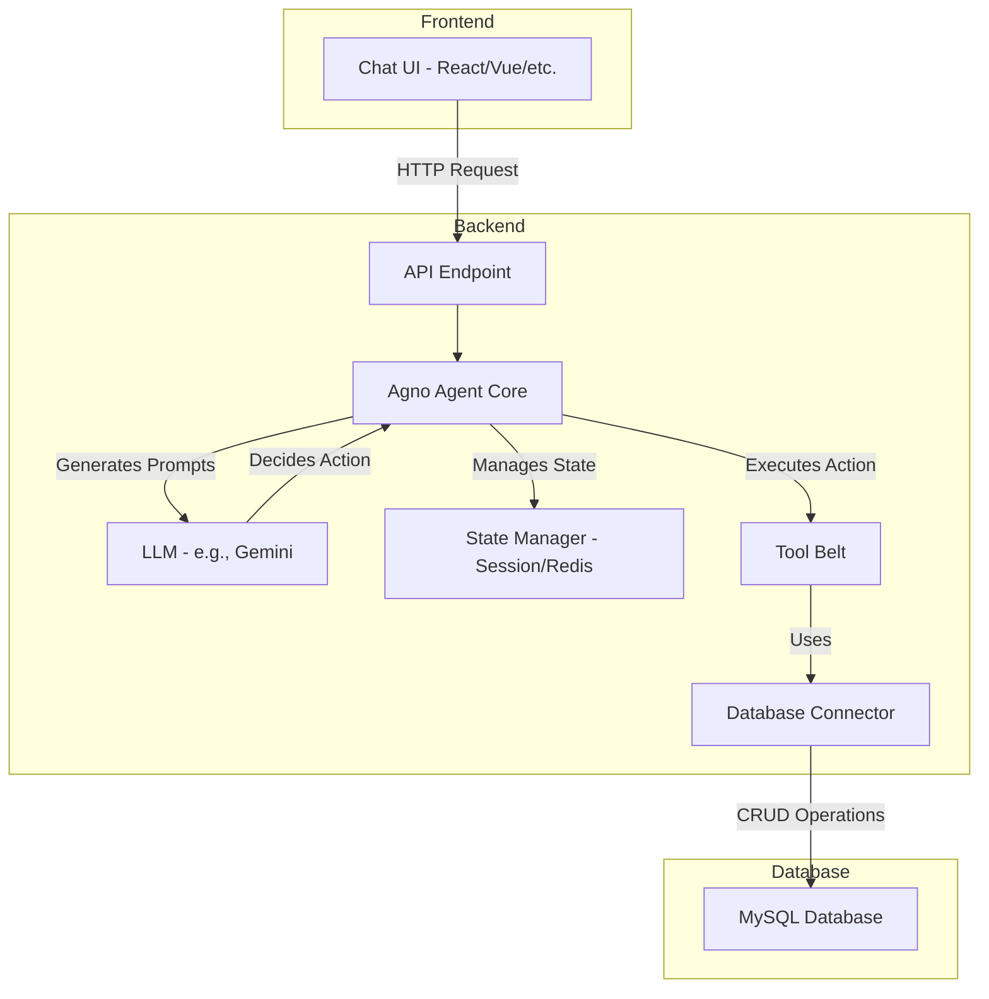

# AI Form-Filling Agent: Development Guide 📝

This document outlines the architecture, design, and implementation plan for building an AI-powered conversational agent. The agent's primary function is to guide users through a form-filling process via a chat interface and submit the collected data to a MySQL database.

## 1. System Architecture Overview

The system follows a standard three-tier architecture, ensuring a clean separation of concerns between the user interface, the core business logic, and data storage.

- **Frontend (Chat UI)**: A lightweight client-side application responsible for rendering the chat interface. It communicates with the backend via a REST API.
- **Backend (Agno Agent Service)**: The brain of the operation. Built using the Agno AI Agent Framework, it manages the conversation, orchestrates the LLM, executes validation and submission logic using a "Tool Belt," and handles user session state.
- **Database (MySQL)**: The persistence layer where the final, validated form data is stored.

### Architecture Diagram



## 2. Database Schema

The target database table is `requests`. The agent's goal is to populate this table.

| Column Name | Required? | Source | Type | Validation / Notes |
|------------|-----------|--------|------|-------------------|
| `id` | Yes | Auto-Generated | INT | Primary Key, Auto Increment |
| `timestamp` | Yes | Agent-Generated | DATETIME | Set to NOW() on submission |
| `email_address` | Yes | Pre-filled (OIDC) | VARCHAR | Captured from user login, not asked in chat |
| `request_state` | Yes | Agent-Generated | VARCHAR | Always set to 'pending' on initial submission |
| `request_eval_date` | Yes | Agent-Generated | DATETIME | Set to NOW() on submission |
| `company_name` | Yes | User Input | VARCHAR | |
| `primary_contact_name` | Yes | User Input | VARCHAR | |
| `primary_contact_email` | Yes | User Input | VARCHAR | Must be a valid email format |
| `secondary_contact_name` | Optional | User Input | VARCHAR | |
| `secondary_contact_email` | Optional | User Input | VARCHAR | Must be a valid email format |
| `sponsor_email` | Yes | User Input | VARCHAR | Must be a valid email format |
| `desired_start_date` | Yes | User Input | DATETIME | |
| `lease_duration` | Yes | User Input | VARCHAR | Must be one of `["1d","2d","1w","2w","1m"]` |
| `timezone` | Yes | User Input | VARCHAR | Must be a valid IANA timezone |
| `project_name` | Yes | User Input | VARCHAR | |
| `openshift_version` | Yes | User Input | VARCHAR | Must match format `4.y` or `4.y.z` |
| `virtualization` | Yes | User Input | BOOL | Defaults to False |
| `description` | Yes | User Input | TEXT | |
| `scope_of_work` | Yes | User Input | TEXT | |
| `cluster_requirements` | Conditional | User Input | TEXT | Required only if virtualization is True |
| `application_type` | Yes | User Input | VARCHAR | Must be one of `["workload", "infrastructure"]` |
| `request_type` | Yes | User Input | VARCHAR | One of `["general", "engineering", "rosa", "nvidia", "virtualization", "ai"]` |
| `cluster_size` | Yes | User Input | VARCHAR | Must be one of `["small", "medium", "large", "xl"]` |
| `notes` | Optional | User Input | TEXT | |
| `cloud_provider` | Yes | User Input | VARCHAR | Must be one of `["aws", "gcp", "azure", "ibm"]` |
| `created_at` | Yes | Auto-Generated | TIMESTAMP | Managed by database |
| `updated_at` | Yes | Auto-Generated | TIMESTAMP | Managed by database |

## 3. Conversational Flow & Logic 💬

This sequence diagram illustrates the complete "happy path" interaction, including the critical pre-submission verification step.

### Conversation Flow Diagram

```mermaid
sequenceDiagram
    participant User
    participant Chat UI
    participant Agno Agent Service
    participant LLM
    participant Agent Tools
    participant MySQL DB

    User->>+Chat UI: "I need a new OpenShift cluster."
    Chat UI->>+Agno Agent Service: Start new session, POST /chat
    Agno Agent Service->>LLM: Instruct: "User wants to start. Ask for the project name."
    LLM->>Agno Agent Service: "Of course! What's the name of the project?"
    Agno Agent Service->>-Chat UI: Send agent response.
    Chat UI->>-User: Displays "Of course! What's the name of the project?"

    Note over User, Agent Tools: ... Conversation continues, filling required fields one by one ... <br/> Agent uses `update_form_data` and `validate_data` tools repeatedly.

    Agno Agent Service->>Agno Agent Service: All required fields are now filled.
    Agno Agent Service->>LLM: Instruct: "All data is collected. Summarize it for the user and ask for final confirmation."
    LLM->>Agno Agent Service: "Great, I have everything I need. Please review the details... Does this look correct?"
    Agno Agent Service->>Chat UI: Send summary and confirmation question.
    Chat UI->>User: Displays the summary for review.

    User->>+Chat UI: "Yes, that's correct."
    Chat UI->>+Agno Agent Service: POST /chat (message: "Yes, that's correct.")
    Agno Agent Service->>LLM: Instruct: "User confirmed. Use the submit_form tool."
    LLM->>Agno Agent Service: Decision: Use tool `submit_form()`.
    Agno Agent Service->>+Agent Tools: Execute submit_form().
    Agent Tools->>+MySQL DB: INSERT INTO requests (...) VALUES (...)
    MySQL DB->>-Agent Tools: Success, returns new record ID (e.g., 12345)
    Agent Tools->>-Agno Agent Service: Success, returns { id: 12345 }

    Agno Agent Service->>LLM: Instruct: "Submission was successful with ID 12345. Inform the user."
    LLM->>-Agno Agent Service: "Perfect! Your request is submitted. Your reference ID is 12345."
    Agno Agent Service->>-Chat UI: Send final success message.
    Chat UI->>-User: Displays "Perfect! Your request is submitted. Your reference ID is 12345."
```

## 4. Backend Implementation (Agno Agent Service)

This is the core of the project. The implementation will revolve around the Agent's prompt and its tools.

### 4.1. System Prompt

The System Prompt is the agent's constitution. It defines its personality, rules, and how it should use its tools. This prompt should be passed to the LLM at the beginning of every turn.

**Python Example** - In a file like `prompts.py`:

```python
# In a file like prompts.py

SYSTEM_PROMPT = """
You are a friendly and efficient administrative assistant. Your sole purpose is to help a user fill out a project request form by asking them questions.

**Your Goal:** Collect all required information, have the user confirm it, and then submit the form.

**Current Form Data:**
{form_data_json}  // This will be dynamically injected

**Field Rules & Instructions:**
1.  **Conditional Fields:** You MUST ask for `cluster_requirements` if, and only if, the user sets `virtualization` to True.
2.  **Provide Options:** For the fields below, you MUST present the user with the allowed choices instead of asking an open-ended question.
    * `lease_duration`: ["1d","2d","1w","2w","1m"]
    * `application_type`: ["workload", "infrastructure"]
    * `request_type`: ["general", "engineering", "rosa", "nvidia", "virtualization", "ai"]
    * `cluster_size`: ["small", "medium", "large", "xl"]
    * `cloud_provider`: ["aws", "gcp", "azure", "ibm"]
3.  **Validate Format:** Use the `validate_data` tool to ensure formats are correct, especially for emails and `openshift_version` (must be like 4.y or 4.y.z).
4.  **Confirmation Step:** Once all required fields are filled, you MUST summarize all the collected information back to the user and ask for their explicit confirmation (e.g., "Does this look correct?") before you use the `submit_form` tool.
5.  **Final Step:** After the user confirms, use the `submit_form` tool.
"""
```

### 4.2. Agent Tool Belt 🛠️

These are the functions the LLM can call. They contain the deterministic business logic.

**Python Example** - In a file like `tools.py`:

```python
# In a file like tools.py
import re
from datetime import datetime

# A simple session manager (can be replaced with Redis for production)
SESSION_STATE = {}

def get_session_data(session_id):
    """Retrieves the current form data for a user's session."""
    return SESSION_STATE.get(session_id, {})

def update_form_data(session_id: str, field_name: str, value: any):
    """Updates a field in the user's form data session."""
    if session_id not in SESSION_STATE:
        SESSION_STATE[session_id] = {}
    SESSION_STATE[session_id][field_name] = value
    return {"status": "success", "field": field_name, "value": value}

def validate_data(field_name: str, value: any) -> bool:
    """Validates the data for a given field based on predefined rules."""
    if field_name.endswith("_email"):
        return bool(re.match(r"[^@]+@[^@]+\.[^@]+", value))
    if field_name == "openshift_version":
        return bool(re.match(r"^4\.\d+(\.\d+)?$", value))
    # ... add other validation rules for timezone, lease_duration, etc.
    return True # Default to true if no specific rule

def submit_form(session_id: str):
    """
    Finalizes and submits the form data to the database.
    Returns the new request ID.
    """
    form_data = get_session_data(session_id)

    # 1. Add agent-generated fields
    form_data['timestamp'] = datetime.now()
    form_data['request_state'] = 'pending'
    form_data['request_eval_date'] = datetime.now()
    # Note: 'email_address' should be fetched from the authenticated user session, not form_data

    # 2. Connect to MySQL database (using an ORM like SQLAlchemy is recommended)
    # db_connection = create_db_connection()
    # new_request = RequestModel(**form_data)
    # db_session.add(new_request)
    # db_session.commit()
    # new_id = new_request.id

    # 3. Simulate DB operation for this guide
    new_id = 12345 # Replace with actual DB result

    # 4. Clean up session
    del SESSION_STATE[session_id]

    return {"success": True, "id": new_id}
```

## 5. Development Roadmap ✅

Use this checklist to track progress:

### Phase 1: Backend Setup
- [ ] Initialize Agno project structure
- [ ] Set up MySQL database and create the requests table
- [ ] Implement the database connector/ORM
- [ ] Implement the basic session manager

### Phase 2: Agent Core Logic
- [ ] Implement the `update_form_data` tool
- [ ] Implement the `validate_data` tool with all required validation logic
- [ ] Implement the `submit_form` tool, including logic for auto-generated fields
- [ ] Finalize and test the SYSTEM_PROMPT

### Phase 3: API & Frontend
- [ ] Build the main `/chat` API endpoint that orchestrates the agent
- [ ] Develop the frontend chat UI
- [ ] Implement OIDC (Google) login on the frontend
- [ ] Ensure the user's auth token is passed to the backend on each `/chat` request

### Phase 4: Integration & Testing
- [ ] Connect frontend to the backend API
- [ ] Conduct end-to-end testing of the full conversational flow
- [ ] Test edge cases (invalid data, user corrections, etc.)
- [ ] Deploy

## 6. Jira User Story: AI-Powered Lab Request Creation

**Story**: As a user, I want to create new lab requests through the AI UI so that I can initiate new lab provisioning without manual dev intervention.

**Acceptance Criteria**:
- The AI can guide the user through the process of providing necessary information for a new lab request
- The AI can successfully submit a new lab request to the system
- The new lab request is accurately recorded in the MySQL database

## 7. Development Tasks (Breakdown)

### Backend Tasks (BE)

These tasks focus on building the foundational logic and server-side components of the AI agent.

#### Task 1: Setup Database Schema
- **Title**: BE: Create and Configure MySQL 'requests' Table
- **Description**: Implement the provided database schema in the target MySQL environment. This involves creating the requests table with all specified columns, data types, and constraints as defined in the development guide. This is the foundational step for data persistence.

#### Task 2: Initialize Backend Project
- **Title**: BE: Initialize Agno AI Agent Project and Dependencies
- **Description**: Set up the Python project structure for the Agno agent. Install all necessary dependencies, including the Agno framework, a MySQL database driver (e.g., mysql-connector-python), an ORM like SQLAlchemy, and any other required libraries.

#### Task 3: Implement Session Management
- **Title**: BE: Implement Session State Manager
- **Description**: Develop a service to manage the conversation state (the in-progress form) for each unique user session. An initial in-memory dictionary is sufficient, with a plan to potentially move to a more scalable solution like Redis if needed.

#### Task 4: Develop Core Agent Tools

**Tool - `update_form_data`**
- Create the agent tool that allows the LLM to save or modify a single piece of information in the user's session state

**Tool - `validate_data`**
- Implement the validation tool with all specified business logic: email regex, OpenShift version format (4.y or 4.y.z), and checking against allowed lists for fields like lease_duration and cloud_provider

**Tool - `submit_form`**
- Create the tool that performs the final submission. It must gather data from the session, add auto-generated fields (timestamp, request_state), retrieve the user's email from their auth context, and insert the final record into the MySQL database. This tool must return the id of the newly created record

#### Task 5: Craft and Integrate System Prompt
- **Title**: BE: Craft and Integrate the System Prompt
- **Description**: Integrate the detailed system prompt into the agent's core logic. Ensure that the current form state is dynamically and accurately injected into the prompt before every call to the LLM.

#### Task 6: Build the API Endpoint
- **Title**: BE: Create the '/chat' API Endpoint
- **Description**: Build the main API endpoint (e.g., using FastAPI or Flask) that will receive requests from the frontend. This endpoint is responsible for managing sessions, orchestrating the agent's turn (prompt, LLM call, tool execution), and returning the agent's conversational response. It must be secured and require an authentication token.

### Frontend Tasks (FE)

These tasks focus on creating the user-facing chat interface and integrating it with the backend.

#### Task 7: Implement User Authentication
- **Title**: FE: Implement OIDC (Google) User Authentication Flow
- **Description**: Integrate the OIDC login flow. After a successful login, the user's ID token must be securely stored in the client to be sent with subsequent API requests. This is crucial for pre-filling the email_address on the backend.

#### Task 8: Build the Chat Interface
- **Title**: FE: Build the Core Chat User Interface
- **Description**: Develop the primary UI components, including a message display area to show the conversation history, a text input for the user to type their messages, and a submit button. The UI should be clean, responsive, and intuitive.

#### Task 9: Integrate UI with Backend API
- **Title**: FE: Connect Chat UI to the Backend '/chat' API
- **Description**: Implement the client-side logic to handle communication with the backend. This includes sending the user's message and auth token to the /chat endpoint and correctly displaying the agent's response (including formatted summaries) in the chat history.

### Integration and Testing Tasks (QA)

This task ensures all components work together as expected and meet the acceptance criteria.

#### Task 10: Perform End-to-End Testing
- **Title**: QA: Test the Full User Journey for Lab Request Creation
- **Description**: Conduct a comprehensive end-to-end test of the entire workflow. This involves:
  - Logging in as a user
  - Initiating a conversation and providing answers for all required fields
  - Verifying the conditional logic for cluster_requirements
  - Reviewing the final summary for accuracy
  - Confirming the submission and receiving a success message with a valid request id
  - Verifying in the MySQL database that the new record was created with all the correct information
